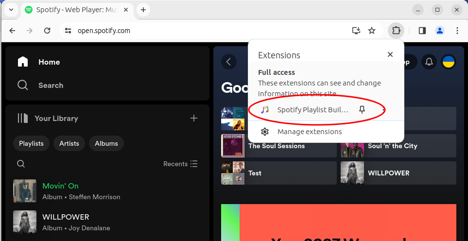
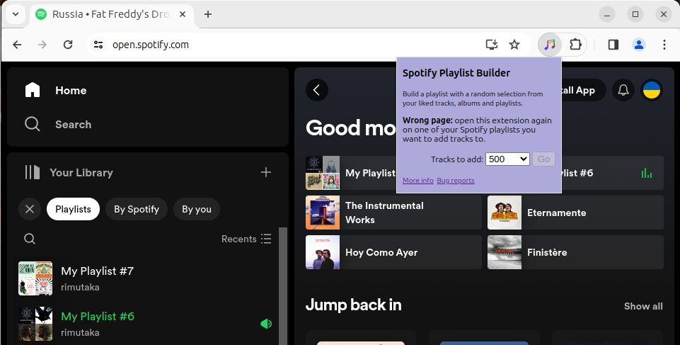
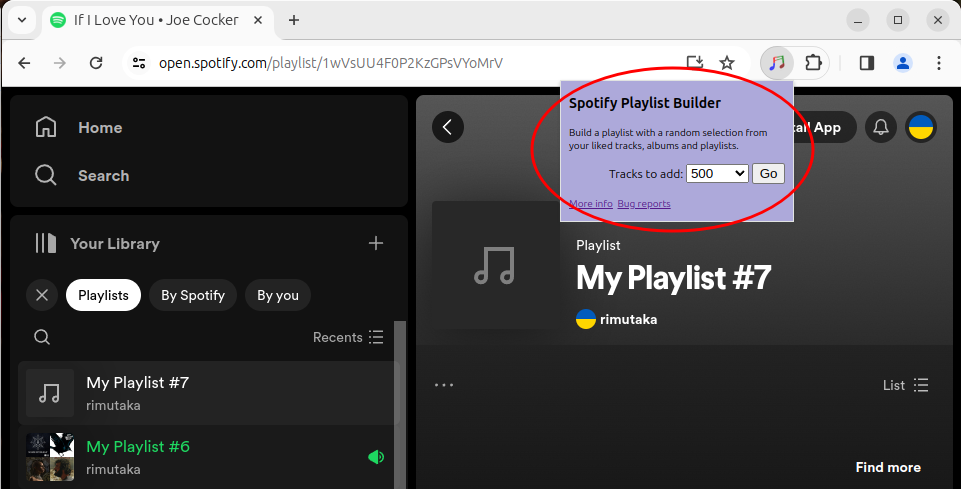
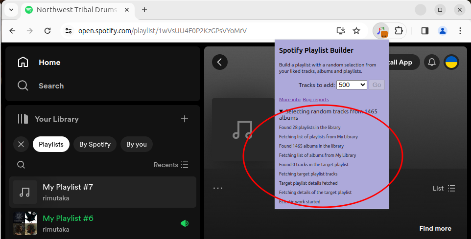
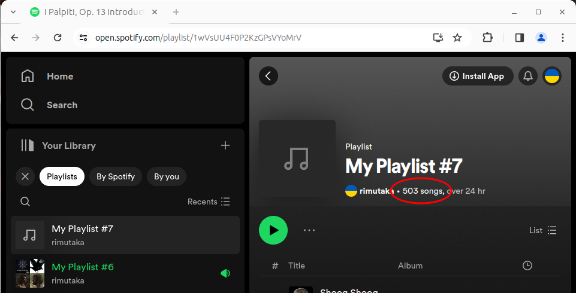

# Chrome extension for generating random playlists from your library tracks, albums and playlists 

This extension builds a Spotify playlist out of a random selection of tracks found in _My Library_ to let you listen to everything you have in there on shuffle.  

It picks tracks from Liked Songs, Liked Albums and Liked Playlists.

### Get started

* Install the extension ([Chrome Webstore](https://chromewebstore.google.com/detail/spotify-playlist-builder/kmbnbjbfpnchgmmkbeidpllpamcahljn))
* Log into Spotify
* Create a new playlist
* Click on the extension button in the toolbar menu to add tracks

Once the extension is running, you can close the Spotify tab or navigate away from the playlist. It will continue creating a shuffled sample of your library in the background. 

The extension popup window receives updates from the background script working on the task. Keep it open to watch the progress. More information is logged into the browser console by WASM and JS scripts. No logs are stored or transmitted anywhere.

### Screenshots

Activate the extension

It works only on a page with a Spotify playlist

Create a new playlist or open a playlist you created earlier and already added tracks to.
New tracks are added at the end of the playlist.

A simple progress log is displayed while the tracks are being added.
Keep the popup window open if you want to watch the updates.

The little badge with `...` over the toolbar button appears while the background script is running. 

Refresh the page to see newly added tracks.

### Feedback and bug reports

Feel free to [open an issue](https://github.com/rimutaka/spotify-playlist-builder/issues) if you run into problems or have any kind of feedback.

### Privacy policy

This extension does not collect any information about the user or user activities.  
The only site it communicates with is Spotify.

## Under the hood

The plugin intercepts the session token from Spotify requests and impersonates the Spotify client to:
* read the contents of the user library
* add random tracks to the current playlist

It does not transmit any of your data to any third party. All requests go to Spotify.

Most of the work is done by [a WASM module](wasm_mod) built in Rust.

### Manifests

Firefox and Chrome have incompatible manifest specs and have to be kept separately.

* manifest.json - either CR or FF for local debugging, not included in the Git repo
* manifest_ff.json - for Firefox
* manifest_cr.json - for Chrome

_build.sh_ script includes the right manifest file in the right package and excludes the others.

**Debugging extensions locally** requires a manual step to rename or clone either _manifest_ff.json_ or _manifest_cr.json_ into _manifest.json_:
- rename the target manifest file into _manifest.json_
- load a temporary extension locally for debugging (requires that _manifest.json_ to be present)
- rename _manifest.json_ back into the target manifest file before packaging the extension
- _build.sh_ script prints an error if you forget to rename _manifest.json_ back

**Debugging in Firefox** requires a manual step of adding permissions after the installation:

- load the temporary addon locally ([about:debugging#/runtime/this-firefox](about:debugging#/runtime/this-firefox))
- open [about:addons](about:addons) and click on the newly installed extension entry in the list of all your extensions
- Firefox will open the extension details page
- click on _Permissions_ tab
- click on the toggles to enable the permissions

Firefox resets the permissions when the extension is uninstalled, but remembers them if you refresh/reload it. See https://extensionworkshop.com/documentation/develop/test-permission-requests/ for more details.

## Attributions

The extension stub was taken from https://github.com/theberrigan/rust-wasm-chrome-ext by https://github.com/theberrigan.

The toolbar icon is based on a vector image by https://rawpixel.com.